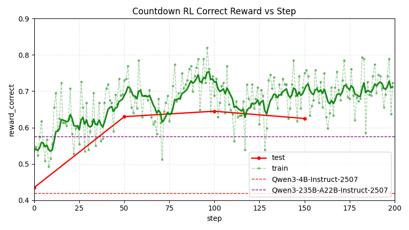

# tinker-countdown

```bash
mv .env.template .env
# 修改 TINKER_API_KEY
```

## 1. Evaluation

```bash
# $0.10
python eval.py --model "Qwen/Qwen3-4B-Instruct-2507" --renderer "qwen3" --limit 200 --concurrency 20

# $0.61
python eval.py --model "Qwen/Qwen3-235B-A22B-Instruct-2507" --renderer "qwen3" --limit 200 --concurrency 20
```

| Model | Accuracy |
| --- | --- |
| Qwen/Qwen3-4B-Instruct-2507 | 0.420 |
| Qwen/Qwen3-235B-A22B-Instruct-2507 | 0.575 |

## 2. RL

```bash
python rl.py model_name="Qwen/Qwen3-4B-Instruct-2507" limit=10000 n_batches=200

# Plot
python plot.py --metrics metrics.jsonl --output reward_correct.png

```


